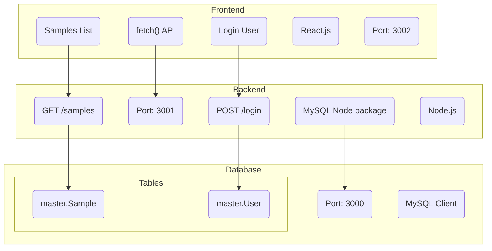

# Groovy Gurus

## Quickstart

- Create `.env` in `/` and `/Backend` folder
- Fill contents based on `.env.sample`

```console
docker compose build && docker compose up
```

## Domain Map


```mermaid
graph TB
    beDB --> dbPort
    feBE --> bePort

    beGETSamples --> dbSampleTable
    feSamplesList --> beGETSamples

    bePOSTLogin --> dbUserTable
    feLoginUser --> bePOSTLogin

    subgraph "Database"
    dbService(MySQL Client)
    dbPort(Port: 3000)
        subgraph "Tables"
        dbUserTable(master.User)
        dbSampleTable(master.Sample)
        end
    end

    subgraph "Backend"
    beService(Node.js)
    bePort(Port: 3001)
    beDB(MySQL Node package)
    bePOSTLogin("POST /login")
    beGETSamples("GET /samples")
    end

    subgraph "Frontend"
    feService(React.js)
    fePort(Port: 3002)
    feBE("fetch() API")
    feLoginUser("Login User")
    feSamplesList("Samples List")
    end
```
